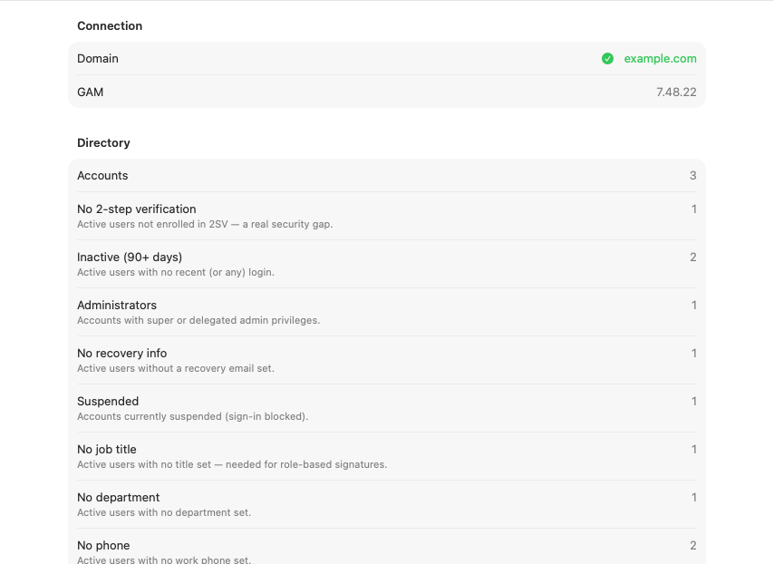
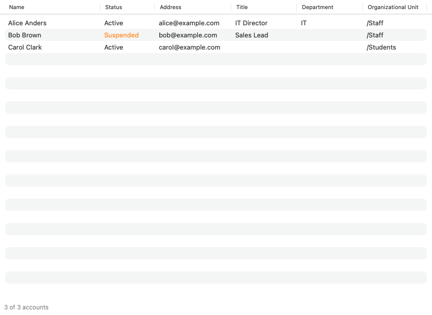
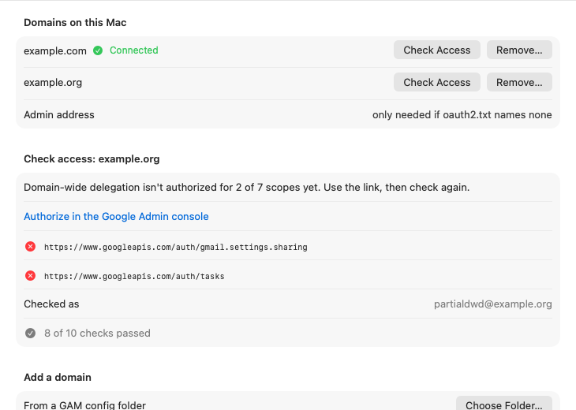

# SwiftGamGui

[](https://github.com/goetchstone/SwiftGamGui/actions/workflows/ci.yml)
[](https://github.com/goetchstone/SwiftGamGui/actions/workflows/codeql.yml)
[](https://scorecard.dev/viewer/?uri=github.com/goetchstone/SwiftGamGui)
[](LICENSE)

A native macOS version of [GamGUI](https://github.com/goetchstone/gamgui), the Google Workspace admin
app built on [GAM7](https://github.com/GAM-team/GAM). It runs the same `gam` commands GamGUI runs, and
the tests check that they match GamGUI's exactly.

**Status: early.** You can import credentials (or copy them from GamGUI), check access, see the
directory's counts and reports, and browse users. Those reads have run against a real tenant;
nothing writes yet. Use GamGUI for real work for now. The plan is in
[docs/plans/2026-10-08-native-gamgui.md](docs/plans/2026-10-08-native-gamgui.md).

Not affiliated with Google or the GAM team.

## Screenshots

Rendered by CI from a demo tenant and the test mock of GAM (`scripts/screenshots.sh`), so the names are
placeholders. Each screen's pull request refreshes its own.

| Home | Users | Setup |
|---|---|---|
|  |  |  |

## Build from source

You need macOS 27 and Xcode 27.

1. Open Xcode once, or run `sudo xcodebuild -runFirstLaunch`, so its components are installed.
2. Download the pinned GAM: `scripts/fetch_gam.sh`.
3. In Xcode → Settings → Accounts, add your Apple ID (a free Personal Team is enough). Then create
   `Config/Local.xcconfig` (it's gitignored) with your team ID:
   ```
   DEVELOPMENT_TEAM = ABCDE12345
   CODE_SIGN_IDENTITY = Apple Development
   CODE_SIGN_ENTITLEMENTS = Config/GamGUI-Team.entitlements
   ```
   Without this file the app still builds, but it can't save credentials to the Keychain.
4. Open `SwiftGamGui.xcodeproj` and build the **GamGUI** scheme in Xcode once (⌘B). Xcode sets up
   signing with your account on that first build. After that you can also build from the command
   line: `xcodebuild -project SwiftGamGui.xcodeproj -scheme GamGUI build`.

A free Personal Team's signing expires after 7 days, so rebuild in Xcode at least once a week. Your
stored credentials survive a rebuild. If you switch to a different team, import them again.

There are no downloadable builds yet: macOS blocks a downloaded app unless it's signed with a paid
Developer ID and notarized by Apple.

## Tests

`swift test --package-path Packages/GamKit`. CI runs the same tests, then builds the app and checks
how it's signed.

The fixtures the tests compare against are generated from GamGUI. To regenerate them you need a GamGUI
checkout next to this one: `../gamgui/.venv/bin/python -I -B scripts/gen_fixtures.py`.

## Live verification

Each write will be listed here. **argv-identical** means it sends exactly the command a GamGUI write
already proven live sent; **confirmed** means this app has itself run it against a real tenant.

| Write | Status |
|---|---|
| Title and department (Users) | **confirmed** (2026-10-09) |
| Suspend and unsuspend (Users) | argv-identical |
| Add to and remove from a group (Users) | argv-identical |
| Add and remove a mail delegate (Users) | argv-identical |

## License

MIT. GAM is Apache-2.0 (`Vendor/gam7/LICENSE`).
